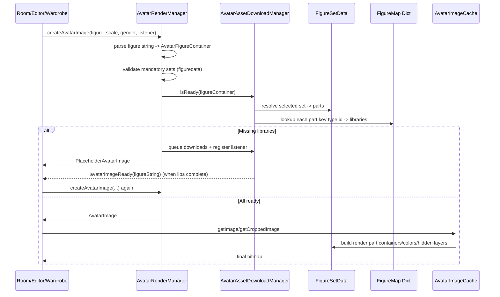

# Habbo Clothing Loading Flow (Full Investigation)

## Scope
This document explains the full clothing-loading pipeline in this codebase, from configuration and `figuredata`/`figuremap` ingestion to runtime rendering, editor previews, wardrobe slots, and clothing furniture flows.

It is based on:
- `C:\habbo\client\habbo-client-clean\src` (decompiled client code)
- `C:\habbo\client\habbo-swfs` (runtime SWF/gamedata pack)

## Executive Summary
Habbo clothing loads through two coordinated datasets:
- `figuredata`: defines what clothing sets and colors exist, eligibility rules, and which logical parts each set contains.
- `figuremap`: maps logical part identifiers (`type:id`) to downloadable SWF libraries.

At runtime:
1. A figure string is parsed into selected set IDs and color IDs.
2. `figuredata` resolves those set IDs into concrete part list entries.
3. Each part (`type:id`) is looked up in `figuremap` to find required SWF libraries.
4. Missing libraries are downloaded asynchronously.
5. While downloads are pending, placeholder avatars are rendered.
6. When downloads finish, listeners are notified and images are re-rendered from the newly available assets.

## Core Files and Responsibilities
- `C:\habbo\client\habbo-client-clean\src\com\sulake\habbo\avatar\AvatarRenderManager.as`
  - Main orchestrator.
  - Creates structure and download managers.
  - Gates global avatar renderer readiness.
- `C:\habbo\client\habbo-client-clean\src\com\sulake\habbo\avatar\AvatarStructure.as`
  - Holds parsed figure/action/geometry data.
  - Builds render part containers from figure selections.
- `C:\habbo\client\habbo-client-clean\src\com\sulake\habbo\avatar\AvatarAssetDownloadManager.as`
  - Loads/parses `figuremap`.
  - Resolves figure -> required libraries.
  - Manages download queue and listener callbacks.
- `C:\habbo\client\habbo-client-clean\src\com\sulake\habbo\avatar\AvatarAssetDownloadLibrary.as`
  - Represents one downloadable clothing SWF library.
- `C:\habbo\client\habbo-client-clean\src\com\sulake\habbo\avatar\structure\FigureSetData.as`
  - In-memory `figuredata` model (set types, set entries, palettes/colors).
- `C:\habbo\client\habbo-client-clean\src\com\sulake\habbo\avatar\AvatarImage.as`
- `C:\habbo\client\habbo-client-clean\src\com\sulake\habbo\avatar\cache\AvatarImageCache.as`
  - Composites part bitmaps into final avatar images.

## Configuration and Data Sources
### Where URLs come from
`AvatarRenderManager.onConfigurationComplete()` reads:
- `external.figurepartlist.txt` (figuredata URL)
- `flash.dynamic.avatar.download.configuration` (figuremap URL)
- `flash.dynamic.avatar.download.url` (base URL for dynamic libs)
- `flash.dynamic.avatar.download.name.template` (library filename template)

Relevant local pack values:
- `C:\habbo\client\habbo-swfs\index.php`
  - `external.figurepartlist.txt` is set to local `.../gamedata/figuredata.xml`
  - `flash.dynamic.avatar.download.configuration` is set to local `.../gamedata/figuremap.xml`
  - `flash.client.url` is set to local `.../gordon/PRODUCTION/`
- `C:\habbo\client\habbo-swfs\gamedata\external_variables.txt` and `.json`
  - Also define defaults (including template `%libname%.swf` and URL `${flash.client.url}`)
  - `external_variables.txt` contains multiple `external.figurepartlist.txt` entries (an early local-like one and a later hashed Habbo URL), so runtime source depends on final resolved configuration inputs.

Important local nuance:
- This pack contains both:
  - `gamedata\figuredata.xml` + `gamedata\figuremap.xml`
  - `gordon\PRODUCTION\figuredata.xml` + `gordon\PRODUCTION\figuremap.xml`
- They are not identical in size/content.
- In this setup, flashvars in `index.php` explicitly point the client to `gamedata` XML for figuredata/map, while dynamic SWF libraries are downloaded from `gordon/PRODUCTION`.

Additional load behavior:
- `AvatarAssetDownloadManager` first checks if an asset named `figuremap` is already present in the asset library and uses it directly if found.
- If remote/config load is needed and fails, figuremap download retries up to 3 times with a `?retry=` or `&retry=` suffix before logging hard failure.

## Deep Dive: `figuredata`
### What `figuredata` contains
File example: `C:\habbo\client\habbo-swfs\gamedata\figuredata.xml`

Top-level structure:
- `<colors>`
  - `<palette id="...">`
    - `<color id index club selectable preselectable>HEX</color>`
- `<sets>`
  - `<settype type paletteid mand_m_0 mand_f_0 mand_m_1 mand_f_1>`
    - `<set id gender club colorable selectable preselectable sellable>`
      - `<part id type colorable index colorindex palettemapid?>`
      - optional `<hiddenlayers><layer parttype="..."/></hiddenlayers>`

### How code parses it
- `AvatarStructure.initFigureData(...)` calls `FigureSetData.parse(...)` for baseline embedded XML (`HabboAvatarFigure`).
- At config time, `AvatarStructureDownload` loads external `figurepartlist` and calls `FigureSetData._Str_1017(...)` to merge in external data.

Key data models:
- `FigureSetData`
  - `_setTypes[type] -> SetType`
  - `_palettes[id] -> Palette`
- `SetType`
  - Stores mandatory flags by gender and club mode (`mand_*` attrs)
  - Contains `Map(setId -> FigurePartSet)`
- `FigurePartSet`
  - Set metadata: `gender`, `club`, `isColorable`, `isSelectable`, `isPreSelectable`, `isSellable`
  - `parts[]` (ordered by type/index handling)
  - `hiddenLayers[]`
- `FigurePart`
  - Logical clothing part identity: `type`, `id`, `index`, `colorindex`, optional `palettemapid`
- `Palette` / `PartColor`
  - Color IDs map to RGB and `ColorTransform`

### How `figuredata` is used at runtime
1. Validating/correcting figures:
   - `AvatarRenderManager.validateAvatarFigure(...)` ensures mandatory set types exist for a gender and replaces invalid selections with defaults.
2. Resolving selected set IDs into concrete parts:
   - `AvatarStructure._Str_713(...)` reads selected set IDs from `AvatarFigureContainer`, then fetches the matching `FigurePartSet` and `FigurePart` entries.
3. Applying colors and hidden layers:
   - `colorindex` selects which color layer to use from figure color IDs.
   - `hiddenlayers` suppress conflicting part types in final composition.
4. Editor filtering:
   - Club level, gender match, selectable/sellable flags drive which items appear.

## Deep Dive: `figuremap`
### What `figuremap` contains
File example: `C:\habbo\client\habbo-swfs\gamedata\figuremap.xml`

Structure:
- `<map>`
  - `<lib id="library_name" revision="...">`
    - `<part type="..." id="..."/>`

Meaning:
- Each `lib` is one downloadable SWF library.
- Each `<part type:id>` entry declares that this library contains assets for that logical part.

### How code parses it
`AvatarAssetDownloadManager._Str_709(...)`:
- For each `<lib>`, create `AvatarAssetDownloadLibrary(id, revision, downloadUrl, template)`.
- For each `<part>`, build key `"type:id"`.
- Append the library object to `_figureMap[key]` (array).

Important behavior:
- A part key can map to multiple libraries.
- Download manager deduplicates libraries before queueing.

### How `figuremap` controls downloads
When a figure is requested:
1. Manager iterates selected set types in the figure container.
2. For each selected `FigurePartSet`, it iterates all `FigurePart` entries.
3. For each part, key = `part.type + ":" + part.id`.
4. It looks up libraries in `_figureMap[key]`.
5. Any library not yet ready is queued for download.

Filename construction:
- `AvatarAssetDownloadLibrary` builds URL as:
  - `downloadBase + template`
  - replace `%libname%` with lib id
  - replace `%revision%` with revision
- Local template is `%libname%.swf`, so `lib id="shirt_M_allem"` resolves to `shirt_M_allem.swf`.

## End-to-End Runtime Flow

## Startup/Readiness Phases
`AvatarRenderManager` becomes ready only when all four are true:
- structure ready (`figurepartlist` merge done)
- figuremap ready
- actions ready (`HabboAvatarActions.xml` loaded)
- effectmap ready

Only then it dispatches `AvatarRenderEvent.AVATAR_RENDER_READY`.

`AvatarAssetDownloadManager` buffers early requests until both:
- figuremap init complete
- renderer ready event received

After each clothing library finishes, `AvatarAssetDownloadManager` dispatches `LIBRARY_LOADED`; `AvatarRenderManager` listens and resets `AssetAliasCollection` so newly loaded aliases/assets are immediately discoverable.

## Download Queue and Callbacks
### Queue mechanics
- Pending queue + current downloads arrays
- Max concurrent downloads: `2`
- Shift timer interval: `100ms`

### Listener mechanics
- Listeners are keyed by complete figure string.
- If the same figure is requested multiple times while incomplete, listeners are accumulated.
- On each library completion, manager checks all tracked incomplete figures.
- For each figure now fully ready, it calls `listener.avatarImageReady(figureString)`.

### Placeholder behavior
`AvatarRenderManager.createAvatarImage()`:
- returns `AvatarImage` if ready
- otherwise queues downloads and returns `PlaceholderAvatarImage` based on hardcoded placeholder figure `hd-99999-99999`
- if render mode is `local_only`, network/dynamic clothing download logic is bypassed and only locally available assets are used.

## How Bitmaps Are Finally Built
1. `AvatarImage.getImage(...)` gets body parts for current action/geometry.
2. For each body part, `AvatarImageCache.getImageContainer(...)` resolves/creates cached part container.
3. `AvatarStructure._Str_713(...)` builds `AvatarImagePartContainer[]`:
   - selected set parts from figuredata
   - action frame data
   - hidden layers
   - selected colors via palette/colorindex
4. `AvatarImageCache._Str_1834(...)` loads concrete bitmap assets by key pattern (for example: `h_std_<partType>_<partId>_<dir>_<frame>` fallback path is present).
5. Applies transforms:
   - color transforms from `PartColor`
   - blend transforms
   - directional flips and offsets
6. Composites per-body-part image, then full avatar image.

## Editor, Wardrobe, and Room Use the Same Pipeline
### Avatar editor preview
- `FigureDataView.update(...)` calls `createAvatarImage(..., listener=this)` when room previewer is not ready.
- On callback `avatarImageReady`, it rebuilds preview.

### Editor grid items
`AvatarEditorGridPartItem` does direct part-preview probing:
- Builds a minimal figure (`type-setId`) and asks renderer if ready.
- If not ready, registers as listener and shows a download icon.
- On callback, it redraws the item preview.

### Wardrobe and outfits
- `WardrobeSlot` and `Outfit` both call `createAvatarImage(..., listener=this)`.
- Their `avatarImageReady` callbacks simply rerun `update()` and re-render thumbnails.

### Room avatars
- `AvatarVisualization` creates avatar images through `AvatarVisualizationData._Str_8991(...)`.
- On `avatarImageReady`, visualization resets cached avatar images and rebuilds sprites.

## Sellable Clothing and Inventory-Bound Logic
### Sellable set gating
In `HabboAvatarEditor.generateDataContent(...)`:
- If a `FigurePartSet.isSellable` is true, it is only shown if:
  - inventory contains that figure set ID (`hasFigureSetIdInInventory(setId)`), or
  - development editor mode is active.

Inventory population path:
- `FigureSetIdsEvent` -> `FigureSetIdsMessageParser`
  - provides `Vector<int> figureSetIds`
  - provides `Vector<String> boundFurnitureNames`
- stored in `HabboInventory` and used by editor/UI.

### Bound furniture names
`hasBoundFigureSetFurniture(className)` is used by purchasable clothing flow (`PurchasableClothingConfirmationView`) to decide whether to auto-apply/update figure.

## Applying Clothing Changes Back to the Player Figure
Rendering/loading and figure persistence are separate concerns:
- Avatar editor save path sends `UpdateFigureDataMessageComposer(figureString, gender)` from `HabboAvatarEditor`.
- Purchasable clothing confirmation can also send figure updates (either immediately for bound furniture, or after confirmation).
- After server acceptance and room/session propagation, updated figure strings are re-rendered through the same load pipeline described above.

## Clothing-Change Furniture Flow
This is a separate UI flow that still uses normal avatar figure/rendering infrastructure:
1. `FurnitureClothingChangeLogic` reads furniture data and stores male/female figure strings on room object model.
2. `FurnitureClothingChangeWidgetHandler` opens avatar editor in restricted categories (`TORSO`, `LEGS`) with chosen gender figure.
3. On save callback (`_Str_21941`), room session sends:
   - `SetClothingChangeDataMessageComposer(objectId, gender, figureString)`

## `figuredata` vs `figuremap`: Exact Relationship
Think of it as:
- `figuredata` = semantic model (what user selected means, eligibility, colorability, hidden layers)
- `figuremap` = asset index (where bitmap resources for parts are physically located)

Resolution chain:
1. Figure string selects set IDs (e.g., `cp-39483433-0`).
2. `figuredata` expands set ID `39483433` into concrete parts (`cp:1300`, `ls:1300`, `rs:1300`).
3. `figuremap` maps those part keys to lib `shirt_M_allem`.
4. Lib SWF is downloaded and merged into asset libraries.
5. Renderer uses those assets to compose output.

## Practical Debug Checklist
If clothing does not appear:
1. Verify renderer reached ready state (all four readiness flags).
2. Verify `figuredata` URL loaded and merged (check set exists in `FigureSetData`).
3. Verify `figuremap` contains mappings for each required `part type:id`.
4. Verify mapped lib SWF exists under dynamic download URL.
5. Verify download manager queued and completed the lib.
6. Verify callback `avatarImageReady` reached caller and image was recreated.
7. Verify final asset key exists in loaded libraries (`h_std_*`/action variants).

## Notes on Obfuscated Method Names
Some methods are obfuscated in this decompile. Common ones used in this write-up:
- `AvatarAssetDownloadManager._Str_1320` -> request/queue figure downloads
- `AvatarAssetDownloadManager._Str_708` -> resolve missing libs for a figure
- `AvatarStructure._Str_713` -> build render part containers
- `FigureSetData._Str_1017` -> merge incoming figuredata
- `FigureSetData._Str_1133` -> cleanup old sets then merge

The behavior descriptions above are based on code paths and data flow, not on symbol naming quality.

